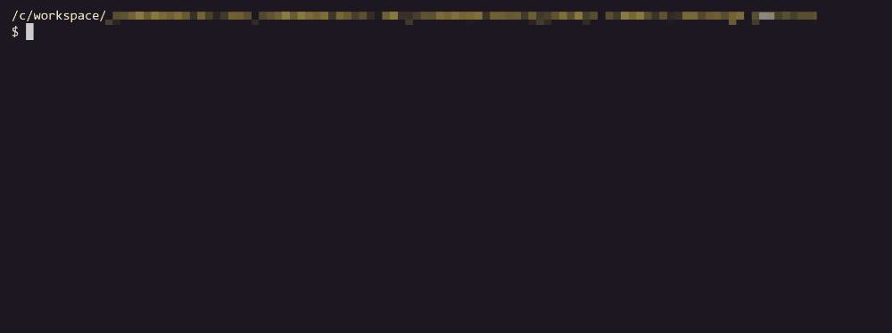

# TP 3.2 - Modules <!-- omit in toc -->

## Sommaire <!-- omit in toc -->
- [Objectifs](#Objectifs)
- [Préparatifs](#Préparatifs)
	- [*Préparatifs 2. :* Le fichier `package.json`](#Préparatifs-2--Le-fichier-packagejson)
	- [*Préparatifs 3.:* Créer un script de build personnalisé](#Préparatifs-3-Créer-un-script-de-build-personnalisé)
- [Instructions](#Instructions)
	- [1. Le support natif des modules dans les navigateurs modernes](#1-Le-support-natif-des-modules-dans-les-navigateurs-modernes)
	- [2. Rendre les modules compatibles avec les vieux navigateurs](#2-Rendre-les-modules-compatibles-avec-les-vieux-navigateurs)

## Objectifs
- Mettre en place les outils nécessaires à l'utilisation des modules ES6 en production
- répartir le code de notre application JSFLIX dans plusieurs modules

## Préparatifs
1. **Récupérez le contenu du dossier `demarrage` du TP** *(vous pouvez également repartir des fichiers de votre tp précédent si vous aviez terminé)*
2. **Lancez un serveur http dans le dossier demarrage/public** :
	```bash
	cd /chemin/vers/demarrage/public
	php -S localhost:80
	```
3. **Ouvrez http://localhost**


### *Préparatifs 2. :* Le fichier `package.json`

Lors du précédent TP nous avons créé un fichier `package.json` à la racine du dossier `demarrage` grâce à la commande `npm init`.

Ce fichier sert à plusieurs choses et notamment :
1. **Il permet de conserver l'historique de tous les paquets qui sont installés dans le projet. C'est en quelque sorte l'équivalent du fichier `pom.xml` de maven en JAVA.** Vérifiez que dans la section `devDependencies` sont bien listés les paquets suivants :
	- @babel/cli
	- @babel/core
	- @babel/preset-env

	À chaque fois qu'on installe un paquet npm, le paquet en question se télécharge dans le dossier `node_modules`, puis le nom du paquet ainsi que sa version sont automatiquement ajoutés dans le fichier `package.json`. Le dossier `node_modules` n'est <u>jamais</u> versionné (c'est en général un dossier relativement volumineux) seul le `package.json` est versionné car il servira de "recette" pour indiquer aux développeurs qui rejoindraient le projet quels sont les paquets nécessaires.

	En effet, un nouveau développeur n'aurait qu'à exécuter la commande `npm install` (sans préciser de nom de paquet) pour installer automatiquement toutes les dépendances du projet !

	C'est donc cette commande que vous allez lancer pour récupérer les différents paquets décrits dans le `packages.json` :
	```bash
	cd /chemin/vers/demarrage
	npm install
	```

2. **Dans ce fichier on va également pouvoir ajouter des "scripts personnalisés" que l'on pourra lancer à l'aide de la commande `npm run xxxxx`.** C'est ce que l'on va utiliser pour nous simplifier la vie dans la suite du TP.

### *Préparatifs 3.:* Créer un script de build personnalisé
Jusque là pour lancer la compilation avec [Babel](https://babeljs.io), nous lancions une des deux commandes suivantes :

```bash
./node_modules/.bin/babel src -d public/build
```
ou
```bash
./node_modules/.bin/babel src -d public/build --verbose --watch --source-maps
```

Avec le `package.json` on va créer des "raccourcis" pour lancer ces commandes plus facilement.

1. Dans Visual Studio Code, **ouvrez le fichier `package.json`** en tapant <kbd>CTRL</kbd>+<kbd>P</kbd> puis le nom du fichier ( <kbd>Enter</kbd> pour ouvrir le fichier)
2. **Localisez la section "scripts" du fichier**. Elle doit ressembler à :
	```json
	"scripts": {
		"test": "echo \"Error: no test specified\" && exit 1"
	},
	```
3. **Cette section permet d'indiquer des tâches qui pourront être lancées à l'aide de la commande `npm run <nom-du-script>`.** Par défaut le `package.json` contient une tâche `"test"`. Lancez le script `"test"` en tapant :
	```bash
	npm run test
	```
	Vous verrez la commande `"echo \"Error: no test specified\" && exit 1"` s'exécuter dans le terminal.
	<br>
	`"test"` est donc une sorte d'alias, de raccourci qui permet de lancer une commande plus complexe.
4. **Ajoutez dans le `package.json` un nouveau script nommé "build"** qui permettra de lancer la compilation Babel plus simplement :
	```json
	"scripts": {
		"test": "echo \"Error: no test specified\" && exit 1",
		"build": "babel src -d public/build"
	},
	```
	*Vous noterez que le chemin  `./node_modules/.bin/' n'est plus nécessaire !*
5. **Lancez la commande `npm run build` et constatez avec émerveillement que la compilation babel se lance.** :
	```bash
	npm run build
	```

	*Si la compilation ne se lance pas, plusieurs raisons possibles : soit Babel n'est pas correctement installé, soit la section "scripts" n'est pas correctement formatée (pensez qu'il s'agit d'un fichier json, par conséquent l'oubli d'une virgule entre chaque script ou au contraire l'ajout d'une virgule à la fin du dernier script, sont considérés comme des erreurs de syntaxe).*
6. **Ajoutez un nouveau script nommé `"watch"` qui permette de lancer la commande** :
	```bash
	./node_modules/.bin/babel src -d public/build --verbose --watch --source-maps
	```
	Lancez la commande `npm run watch` et vérifiez que lorsque vous modifiez le fichier `src/main.js`, le fichier `build/main.js` est bien mis à jour.

## Instructions
**Comme vu dans le chapitre précédent, le système de modules ES6 permet de répartir son code dans plusieurs fichiers et de gérer les dépendances de l'application fichier par fichier plutôt que d'avoir à maintenir une liste exhaustive des scripts à charger dans le fichier html.**

Le [support navigateur des modules ES6](https://caniuse.com/#feat=es6-module) est plutôt bon mais pas encore suffisant pour des applications grand public (absence de support sur IE et android 4.4).

Dans un premier temps nous allons mettre de côté ce problème et nous appuyer sur le fait que les dernières versions de Chromium/Chrome et FireFox supportent nativement les modules ES6.
<br>Par la suite nous verrons comment solutionner ce problème de compatibilité à l'aide de Webpack.

### 1. Le support natif des modules dans les navigateurs modernes
1.  **Avant d'utiliser le système de modules et les instructions `import`/`export`, il faut indiquer au navigateur que notre fichier main.js est lui même un module.** Pour cela, ajouter un attribut `type="module"` dans la balise `<script>` du fichier `index.html` :
	```html
	<script type="module" src="build/main.js"></script>
	```
	Vous notez que l'attribut `"defer"` n'est plus nécessaire car il est implicite pour les modules.
2. **Il faut ensuite configurer Babel.** En effet, par défaut Babel va chercher à compiler toutes les instructions `import` et `export` qu'il trouvera pour les transformer en code compatible ES5 (mais qui nécessite l'emploi de librairies supplémentaires). Ici on veut utiliser le support natif du navigateur pour les modules ES6, par conséquent il faut indiquer à Babel de ne pas compiler les `import`/`export`. Modifiez le fichier `.babelrc` comme suit (notez le tableau dans un tableau !) :
	```json
	"presets": [
		["@babel/preset-env", {"modules": false}]
	],
	```

	Pour prendre en compte la nouvelle configuration de Babel, stoppez (<kbd>CTRL</kbd>+<kbd>C</kbd>) puis relancez la compilation à l'aide de la commande `npm run watch`

3.  **Passez les fonctions `getSlideshowImages`,`renderSlideshow` et `slideNext` dans un module nommé `slideshow.js`**. `renderSlideshow` sera l'export par défaut. Rappelez vous, tout ce qui est défini dans un module (variables, fonctions, ...), n'existe qu'à l'intérieur du module sauf s'il est exporté puis importé dans un autre fichier.

	*NB1: Pour rappel, exporter par défaut une constante sur la même ligne que sa création est interdit :*
	```js
	export default const data = [...]; // ERREUR !
	```
	*Il faut obligatoirement faire cela en deux étapes :*
	```js
	const data = [...];
	export default data; // OK !
	```
	***NB2:** Un export simple (pas par défaut) est en revanche autorisé :*
	```js
	export const data = [...]; // OK !
	```
	***NB3:** Cette restriction ne s'applique pas aux fonctions et aux classes ; on peut tout à fait faire :*
	```js
	export default function maFonction() {...} // OK !
	```

4. **Compilez votre code et testez la page dans le navigateur** : le résultat doit être identique à celui obtenu précédemment.

5. **Ouvrez l'onglet Réseau/Network des devtools, vous devez normalement voir le chargement automatique des différents modules** (une ligne par fichier JS).

### 2. Rendre les modules compatibles avec les vieux navigateurs

**Pour rendre nos modules compatibles avec les anciens navigateurs, il faut utiliser un "bundler".** Cet outil va permettre d'assembler en un seul fichier toutes les dépendances (tous les scripts JS) de notre application. Le navigateur n'a alors qu'un seul fichier à charger et plus à se soucier des modules.

Comme vu dans le chapitre précédent, le bundler le plus employé en JS est [Webpack](https://webpack.js.org/), c'est donc cet outil que l'on va installer et configurer.

1. **Dans le fichier `index.html`, retirez l'attribut `type="module"` de la balise script et remettez l'attribut `defer`. Remplacez aussi le nom du fichier `build/main.js` par `build/main.bundle.js`.** C'est en effet une pratique courante de nommer les fichiers de ce type avec le mot "bundle".

2. **Installez webpack** à l'aide de la commande suivante :
	```bash
	npm install --save-dev webpack webpack-cli babel-loader
	```
2. **Créez à la racine du dossier `demarrage` (au même niveau que le `package.json` et le `.babelrc`) un fichier `webpack.config.js`** et placez y le code suivant :
	```js
	const path = require('path');
	module.exports = {
		entry: './src/main.js', // Fichier d'entrée
		output: { // Fichier de sortie
			path: path.resolve(__dirname, './public/build'),
			filename: 'main.bundle.js'
		},
		module: {
			rules: [{
				test: /\.js$/, // tous les fichiers .js ...
				exclude: /node_modules/, // ... sauf le dossier node_modules ...
				use: { // ... seront transpilés par babel
					loader: 'babel-loader'
				}
			}]
		},
		devtool: 'source-map'
	}
	```

3. **Modifiez les scripts `"build"` et `"watch"` du fichier `package.json` pour replacer babel par webpack** (*notez quand même que babel sera toujours utilisé, mais c'est webpack qui va directement le piloter*):
	```json
	"build": "webpack --mode=production",
	"watch": "webpack --mode=development --watch"
	```
4. **Lancez la compilation** : stoppez le watch précédent (<kbd>CTRL</kbd>+<kbd>C</kbd>) et relancez la compilation à l'aide de la commande `npm run watch` (*qui lancera cette fois webpack et plus Babel*)
5. **Enfin, vérifiez dans le navigateur que la page s'affiche toujours** et que dans l'onglet "Réseau"/"Network" vous n'avez maintenant bien plus qu'un seul fichier JS téléchargé par le navigateur : le `build/main.bundle.js`


