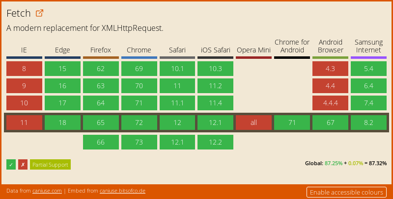

# TP 7.1 Échange de données - AJAX <!-- omit in toc -->

## Sommaire <!-- omit in toc -->
- [Objectifs](#objectifs)
- [Préparatifs](#préparatifs)
- [Instructions](#instructions)
	- [1. Charger un fichier statique](#1-charger-un-fichier-statique)
	- [2. Appeler une API REST/JSON en GET](#2-appeler-une-api-restjson-en-get)
- [Pour aller plus loin](#pour-aller-plus-loin)

## Objectifs
- Charger des fichiers statiques avec l'API fetch
- Connecter notre application JSTV à des webservices (API REST JSON) et exploiter les données retournées

## Préparatifs
1. **Récupérez le contenu du dossier `demarrage` du TP** *(vous pouvez également repartir des fichiers de votre tp précédent si vous aviez terminé)*
2. **Lancez un serveur http dans le dossier demarrage/public** :
	```bash
	cd /chemin/vers/demarrage/public
	php -S localhost:80
	```
3. **Ouvrez http://localhost**
4. **Installez les dépendances du projet (babel, webpack, jquery, etc.)** à l'aide de la commande :
	```bash
	cd /chemin/vers/demarrage
	npm install
	```

## Instructions

Comme vu en cours il existe deux méthodes pour charger/envoyer des données en JS : [XMLHttpRequest](https://developer.mozilla.org/en-US/docs/Web/API/XMLHttpRequest) et l'[API fetch](https://developer.mozilla.org/en-US/docs/Web/API/Fetch_API/Using_Fetch)

**C'est l'API fetch que nous utiliserons dans ce TP.**
<br>En effet, elle dispose d'une syntaxe plus concise, avec laquelle il est plus facile de chaîner les traitements grâce aux [Promises](https://developer.mozilla.org/fr/docs/Web/JavaScript/Guide/Utiliser_les_promesses).

Pour rappel, le support navigateur de l'API fetch est plutôt bon, mais il reste encore plusieurs points problématiques :

<a href="https://caniuse.com/#feat=fetch"></a>

Comme on peut le voir, **aucune version d'Internet Explorer n'est compatible avec l'API fetch**. C'est aussi le cas des versions d'android 4.4.4 et inférieures. Heureusement, un [polyfill](https://fr.wikipedia.org/wiki/Polyfill) développé par Github est disponible ici : https://github.com/github/fetch. Sur un projet réel il faudrait mettre en place ce polyfill, mais pour gagner du temps nous ignorerons cette problématique dans le TP (ne faites pas ça dans la vraie vie !).


### 1. Charger un fichier statique
**Avant de connecter notre application au serveur REST/JSON, nos allons nous entraîner sur un fichier statique.**

1. **Créez un fichier `news.html` dans le dossier `demarrage/public` avec le code html suivant** :
	```html
	<article class="news">
	  <h2>La dernière actu</h2>
	  <p>
	    Bienvenue sur le tout nouveau site JS
		 !
	  </p>
	</article>
	```
2. **Dans le fichier main.js, lancez le chargement du fichier `news.html` avec l'API fetch** :
	```js
	fetch('./news.html');
	```

	Rechargez la page html dans le navigateur et vérifiez dans l'onglet Network/Réseau des devtools que votre page lance bien le chargement du fichier `news.html`.

	Notez qu'il s'agit bien d'une requête HTTP et pas d'un appel à un fichier local : l'URL de la requête est bien http://localhost/news.html c'est donc bien le serveur HTTP (lancé par PHP) qui génère la réponse HTTP retournée au navigateur.

	Maintenant que l'on arrive à charger le fichier, reste à exploiter les données qu'il contient !
3. **Commencez par inspecter la réponse retournée par `fetch()` grâce à la méthode `.then()`** :
	```js
	fetch('./news.html')
		.then( response => console.log(response) );
	```

	Rechargez la page et regardez ce qui s'affiche dans la console : il s'agit de l'objet de type [Response](https://developer.mozilla.org/en-US/docs/Web/API/Response) retourné par l'API fetch.

	Comme vu en cours, cet objet contient notamment des propriétés `ok`, `status` et `statusText` qui permettent d'en savoir plus sur la réponse HTTP retournée par le serveur.

4. **On va maintenant pouvoir récupérer les données brutes contenues dans la réponse HTTP grâce à la méthode [response.text()](https://developer.mozilla.org/en-US/docs/Web/API/Body/text)** :
	```js
	fetch('./news.html')
	  .then( response => response.text() )
	  .then( responseText => console.log(responseText) );
	```
	Vérifiez que la console affiche bien le contenu HTML du fichier `news.html`

	*Maintenant que l'on est capable de récupérer le contenu du fichier `news.html` il ne reste plus qu'à **l'injecter dans la page HTML** !*

5. **Pour bien comprendre l'ordre d'exécution et l'asynchronisme, ajoutons des instructions `console.log()` dans le code précédent comme suit** :
	```js
	console.log(1);
	fetch('./news.html')
	  .then( response => response.text() )
	  .then( responseText => console.log(responseText) );
	console.log(2);
	```
    Regardez dans quel ordre s'affichent les log dans la console.

	Est-ce que cela vous semble normal ? Non ? C'est pourtant logique : la fonction qui est passée au deuxième `.then()` n'est exécutée qu'une fois que la requête http est terminée (càd. une fois que le fichier est fini de télécharger). Le reste du code continue de s'exécuter en attendant que la requête se termine !

	Si vous avez compris, vous pouvez effacer les `console.log` inutiles et passer à la suite. Sinon appelez le formateur !

6. **À l'aide de l'API DOM injectez le contenu du fichier `news.html` au début de la balise `<aside class="sidebar">`**. Plutôt que de tout coder dans le `.then()` on va passer par une nouvelle fonction `displayNews`:
	```js
	function displayNews(html) {
	    //
	}
    fetch('./news.html')
	    .then( response => response.text() )
	    .then( displayNews );
	```


### 2. Appeler une API REST/JSON en GET
**Maintenant que l'on est capables de récupérer une ressource externe en JS et d'en afficher le contenu, connectons notre application à [l'API REST de tvmaze.com](https://www.tvmaze.com/api)**

1. Dans le fichier `main.js`, supprimer l'import du fichier `data.json`,  affectez un tableau vide à `searchResults.results` :
	```js
	searchResults.results = [];
	```
2. Dans le callback `onSubmit` du `searchForm` déclenchez un appel AJAX vers l'URL http://api.tvmaze.com/search/shows?q= concaténée avec la valeur sasie dans le formulaire de recherche.

	Vérifiez que l'appel ajax fonctionne correctement dans l'onglet Network des devtools.
3. Communiquez la liste des résultats au composant searchResults à l'aide de la propriété `results`.

	Ca y est ! La page s'affiche maintenant avec la liste des séries qui correspondent à la recherche ! :metal: :tada: :trophy: :beers:

## Pour aller plus loin
Détectez le clic sur un résultat et afficher une div contenant la liste des épisodes de la série. La liste des épisodes est disponible sur l'API https://www.tvmaze.com/api#show-episode-list
